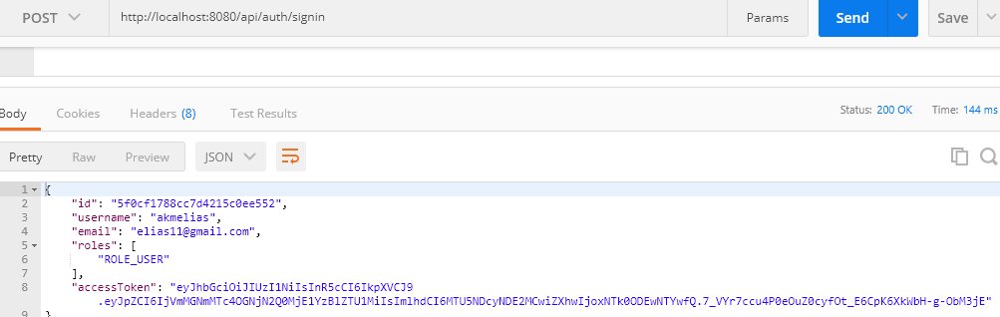
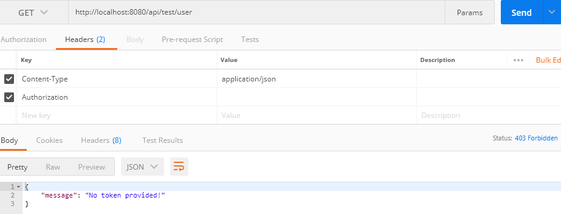
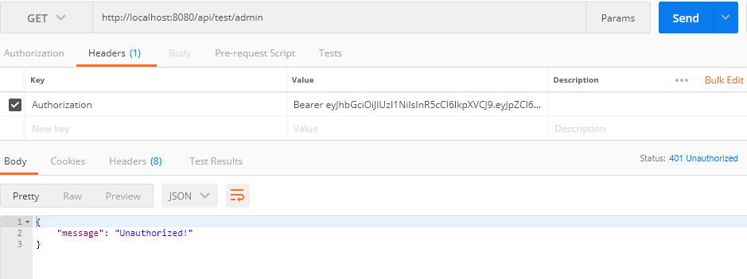
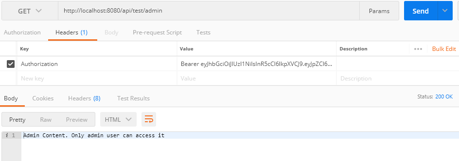
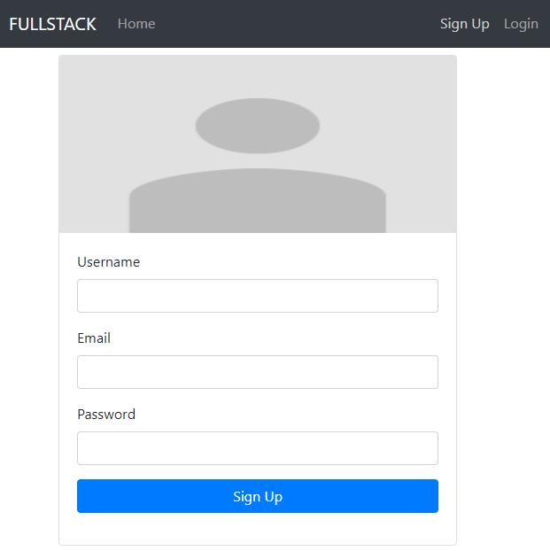
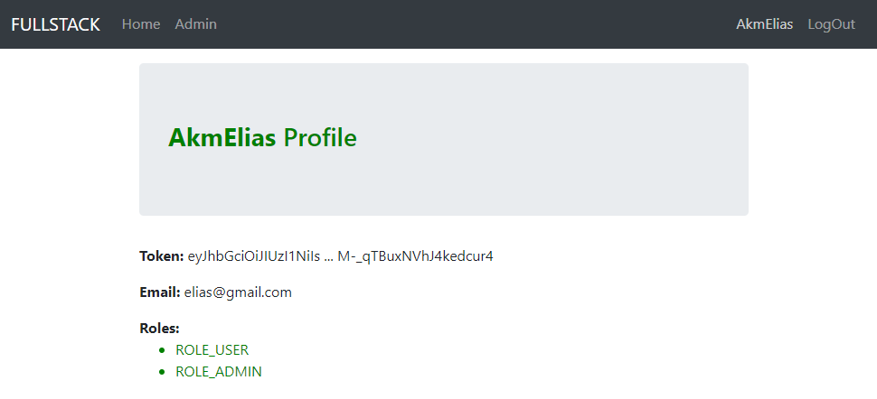
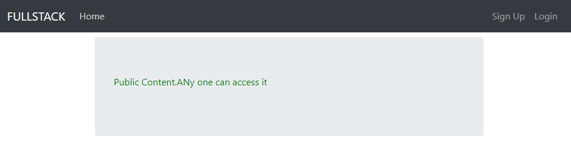
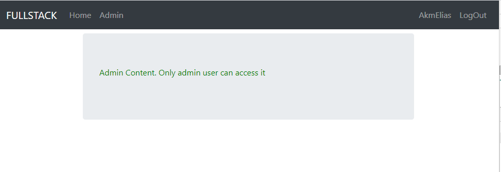

# fullstack -  A meant stack app with basic auth flow service. With user signup and login apis. The apis are  jwt token based. 

 There are seperate README file for both fullstack_api and fullstack-client apps given within respective folder.
 Few server side screen shots of REST API with JWT token flow

# signin api 

# api not token provided

# unothorized 

# content only for admin user

# few client side screen shots of REST API with JWT token flow

# register ui
 
 
# profile with roles

# public content no authentication needed 

# admin only content

